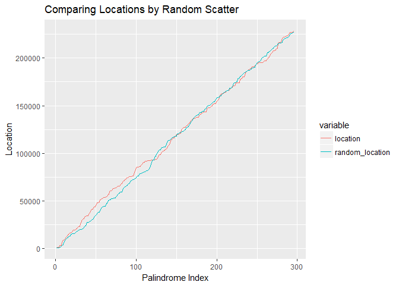
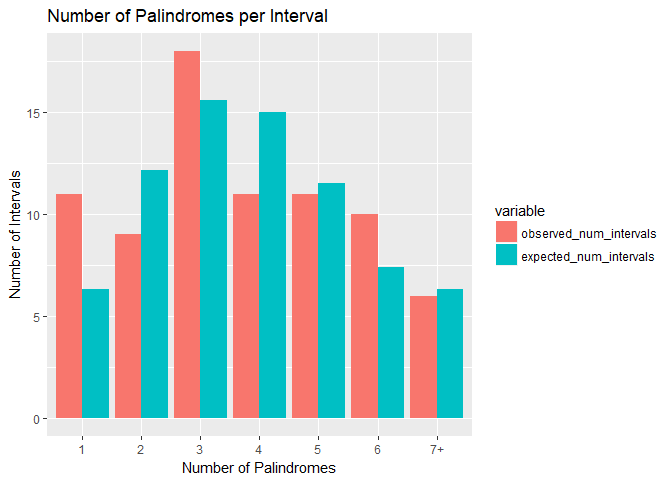
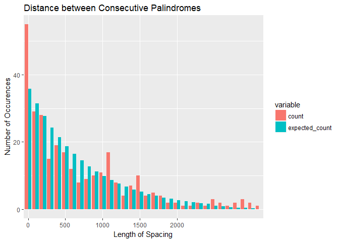
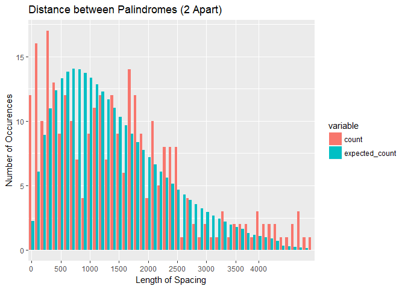
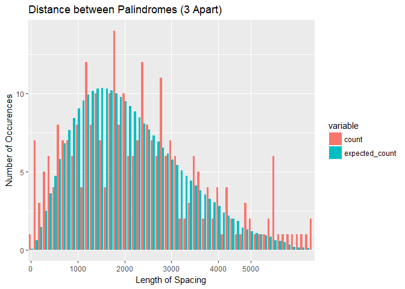

Analysis of the Location of Palindromes in DNA Sequence of Human Cytomegalovirus
================
Hubert Luo
March 20, 2018

### Introduction

DNA contains information that provides the basis for who we are as human beings so it is integral for us to further investigate any patterns that can be found in DNA. After Chee et al. published the DNA sequence of human cytomegalovirus (CMV), Leung et al. found 296 palindromes that were at least 10 letters long. Therefore, a natural question to ask is whether there is some pattern in the placements of palindromes in the DNA sequence of CMV. Specifically, we will investigate whether the placements of palindromes in the DNA sequence of CMV follows a Poisson distribution with a focus on four areas: Random Scatter, Spacing, Counts, and Maximum Number of Palindromes. We will then use the maximum number of palindromes as a test statistic to perform a test on whether the palindromes follow a Poisson process.

### Methodology

The data used was originally gathered by Leung et al. in 1990 after they implemented search algorithms to analyze the DNA sequence of CMV and accessed from the Nolan/Speed Stat Labs webpage. The data contains one variable, the location of the palindrome in the DNA sequence of CMV, and consists of integers between 1 and 229,354 inclusive, representing the different base pairs in the DNA sequence. The statistical machinery used in this report is primarily applying knowledge about various distributions to compare observed and expected values in addition to conducting a goodness of fit test for the counts and a hypothesis test regarding the distribution of palindromes using the maximum number of palindromes in an interval as the test statistic.

### Results

First, we looked at the random scatter of palindromes in the data by choosing 296 spots at random uniformly on the DNA sequence for the palindromes. From the graph below, which tracks the location in the DNA sequence where each palindrome occurs, the randomly selected locations of the palindromes generally appear to follow that of the observed palindrome locations.

Next, we looked at the difference between the observed and expected number (if following Poisson distribution) of palindromes in various intervals. Bin widths of 3000 were chosen so the bin widths are small enough that we can actually compare observed and expected number of palindromes but also large enough that most of the bins do *not* have entries of zero. The table below lists the observed and expected number of palindromes, with the parameter lambda for the Poisson distribution found to be the Number of Palindromes/Number of Intervals = 3.844.

| Palindrome Count |  Observed Number of Intervals|  Expected Number of Intervals|
|:-----------------|-----------------------------:|-----------------------------:|
| 1                |                            11|                         6.336|
| 2                |                             9|                        12.178|
| 3                |                            18|                        15.604|
| 4                |                            11|                        14.996|
| 5                |                            11|                        11.530|
| 6                |                            10|                         7.387|
| 7+               |                             6|                         6.337|

From the above chart and visualization, we can see that the observed number of palindromes per interval generally seem to be close to around 10 intervals for each number of palindromes in an interval. Overall, the distribution seem to be closer together than expected, with the exception of the number of intervals with 3 palindromes which exceeds every other observed value by a fairly large amount. More formally, we can apply a goodness of fit test to our results in order to see if the random scatter model is true. If it was true, the test statistic should have a chi-squared distribution with 5 degrees of freedom (7 categories - 1 parameter - 1 = 5). The observed test statistic was calculated to be around 6.662. The probability of getting a test statistic at least as large as the observed statistic is 0.247. As a result, we can conclude that the Poisson fits the data reasonably well, although there are likely deviations such as unusual clusters of palindromes.

Therefore, it is natural for us to investigate whether there are clusters present by looking at the spacing between palindromes, with the results outlined in the table and plot below. If the palindromes have a Poisson distribution, the spacing should have an exponential distribution with parameter lambda = Number of Palindromes/Number of Base Pairs = 0.00129.

    ## # A tibble: 32 x 3
    ##    interval count expected_count
    ##    <fct>    <int>          <dbl>
    ##  1 0           55           35.8
    ##  2 100         29           31.5
    ##  3 200         28           27.7
    ##  4 300         15           24.3
    ##  5 400         19           21.4
    ##  6 500         17           18.8
    ##  7 600         12           16.5
    ##  8 700          8           14.5
    ##  9 800          9           12.8
    ## 10 900         10           11.2
    ## # ... with 22 more rows

From the plot, we see that the data generally looks like it follows an exponential distribution as expected, but it seems like there are a high number of consecutive palindromes which are very close together, possibly signifying a cluster. However, in order to determine this we need to look at the sum of the intervals, or the distance between palindromes which are 2 or 3 apart.

We first look at the distance between palindromes which are two apart (Sum of 2 intervals). We expect the number of occurrences of each spacing length to have Gamma(2,lambda=Number of Palindromes/Number of Intervals = 3.844) distribution. The following table and plot contains the results of our analysis for the distance between palindromes which are two apart, with columns for the expected and observed number of occurrences.

    ## # A tibble: 49 x 3
    ##    interval count expected_count
    ##    <fct>    <int>          <dbl>
    ##  1 0           12           2.26
    ##  2 100         16           6.05
    ##  3 200         10           8.89
    ##  4 300         17          11.0 
    ##  5 400         13          12.4 
    ##  6 500          9          13.3 
    ##  7 600         12          13.8 
    ##  8 700         10          14.0 
    ##  9 800          7          14.0 
    ## 10 900          4          13.7 
    ## # ... with 39 more rows

As seen from the plot when comparing the red bars (observed count, or number of occurrences of each spacing) with the blue bars (expected number of occurrences of each spacing if the data follows the Gamma distribution), the distribution does not seem to closely follow the Gamma(2,3.844) distribution. In particular, there seems to be a much higher than expected number of intervals of very low spacing length, i.e., below 500. There are also a much higher than expected number of intervals of extremely high spacing length (over 4,000). This illustrates there the palindromes appear to be bunched together in the DNA sequence, with some intervals that are very short or very long.

This is also seen when we look at the distance between palindromes which are three apart (sum of 3 intervals), which we would expect to have Gamma(3,lambda=Number of Palindromes/Number of Intervals = 3.844) distribution. The following table and plot contains the results of our analysis for the distance between palindromes which are three apart, with columns for the expected and observed number of occurrences.

    ## # A tibble: 61 x 3
    ##    interval count expected_count
    ##    <fct>    <int>          <dbl>
    ##  1 0            1         0.0963
    ##  2 100          7         0.604 
    ##  3 200          3         1.45  
    ##  4 300          5         2.48  
    ##  5 400          6         3.60  
    ##  6 500          4         4.73  
    ##  7 600          8         5.81  
    ##  8 700          7         6.79  
    ##  9 800          7         7.67  
    ## 10 900          6         8.42  
    ## # ... with 51 more rows

Again, from the plot when comparing the red bars (observed count, or number of occurrences of each spacing) with the blue bars (expected number of occurrences of each spacing if the data follows the Gamma distribution), the distribution does not seem to closely follow the Gamma(3,3.844) distribution. In particular, we again observe that there are a higher than expected number of intervals of low spacing length, i.e., less than 500, as well as a higher than expected number of high spacing lengths of over 5,000. Therefore, this again illustrates there the palindromes appear to be bunched together in the DNA sequence, with many intervals being very short or very long. In order to investigate this more in depth, we will now look at the maximum number of palindromes in an interval.

More formally, we will now test whether the distribution of palindromes follows a Poisson process by using the maximum number of palindromes in an interval as a test statistic. In the data analyzed for the 77 intervals, it was found that the observed test statistic (max number of palindromes in an interval) was 13 in Interval \#31. As previously mentioned, an interval width of 3000 was selected so that the interval is wide enough that a cluster of palindromes would appear in a high-count interval but also narrow enough that we can actually detect instances of intervals which have significantly more palindromes.

For the test, let the null hypothesis to be that the maximum number of palindromes behaves like the maximum of independent Poisson random variables. Then, let the alternative hypothesis be that the abnormally high max in interval \#31 is due to something other than random chance, i.e., that there is an alternative reason for the larger-than-expected cluster. Then, we calculated that under the null hypothesis, the the probability that the max count over the 77 intervals is higher than or equal to 13 is about 0.0144. Thus, the p-value is 1.44% so our test findings are significant and we reject the null at the 5% level. Thus, we have found evidence in favour of the alternative hypothesis, that the maximum number of palindromes in an interval does not behave like the maximum of independent Poisson random variables. Therefore, our test shows that the abnormally high number of palindromes interval \#31 is likely due to something other than random chance, for example if it is the location of the DNA origin of replication.

### Discussion

Although the goodness-of-fit test demonstrated that deviances of the data from a Poisson distribution are likely due to random chance alone, the second hypothesis test presents fairly strong evidence against the Poisson distribution being a good fit for the data, i.e., that the deviances from the expected distribution cannot be explained by random chance alone. These seemingly contradictory findings can be explained by the fact that although the overall distribution of palindromes somewhat resembles a Poisson distribution, such a resemblence fades once we look more closely at clusters of palindromes, as demonstrated in the second test.

However, our results are limited in that they do not tell us what exactly the alternative reason for the high number of palindromes in interval \#31 is. It may very well be that it is home to the DNA origin of replication as suggested above, or it may be due to some other reason and such a test above does not provide us that reason. While the findings can mostly be generalized to other DNA sequences, it remains possible that other confounding factors which may affect other DNA sequences differently than the one analyzed here, for example if palindromes appear with different distributions depending on the specific DNA sequence being studied. Therefore, our conclusions may not be fully generalizable to every other DNA sequence.

### Conclusion

It was found through the chi-square goodness-of-fit test that the overall distribution of palindromes somewhat resembles a Poisson distribution, this is not the case when we look at more granular data for clusters of palindromes as witnessed in the second hypothesis test. Using the maximum number of palindromes in an interval as the test statistic, we found that the statsitic does not behave like the maximum of independent Poisson random variables, which supports the claim that the distribution of palindromes in the DNA sequence investigated is not Poisson.
